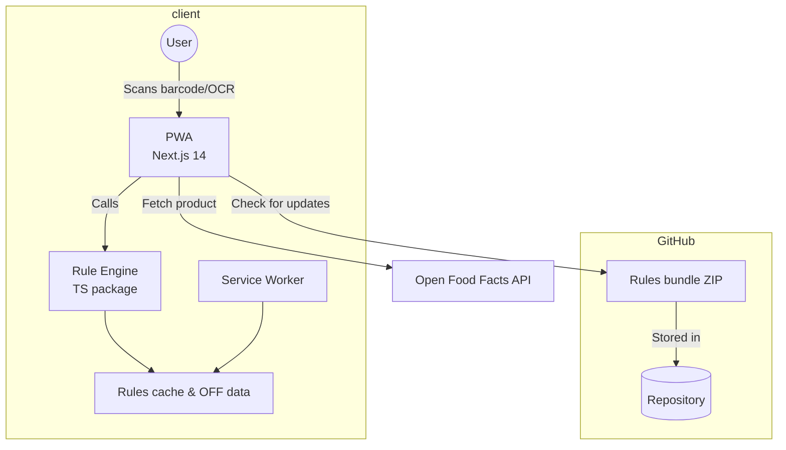

# Architecture

The Halal Scanner is implemented as a monorepo with three workspaces: a web application, a rule engine and a collection of rule bundles plus tools for ingesting data.  The key interactions are illustrated below.

## Components

### `apps/web`

The web PWA is built with Next.js 14 using the **App Router**.  It uses Tailwind CSS for styling and `shadcn/ui` for accessible components.  Barcode scanning is implemented using [`@zxing/library`](https://github.com/zxing-js/library) (or `quagga2` as a fallback).  OCR for ingredient lists is powered by [`tesseract.js`](https://github.com/naptha/tesseract.js) and lazy‑loaded when needed.

The client obtains product information by querying the Open Food Facts API using only the barcode.  It then uses the rule engine to evaluate each ingredient.

### `packages/engine`

The rule engine is a small, pure TypeScript library that loads the YAML rules defined in `packages/rules` and exposes functions to:

1. **Tokenize** a string of ingredients into canonical tokens (normalising punctuation, lowercasing, removing parentheses and splitting on commas/semicolons).
2. **Lookup** each token in the ingredient and E‑number tables (with fuzzy matching and synonyms).
3. **Evaluate** each token’s status (HALAL, HARAM or DOUBTFUL) and return an explanation object containing reasons and source citations.

Because it is pure, the engine can run in any JavaScript environment – including the browser, Node.js and the tools.

### `packages/rules`

This package contains the YAML data for ingredients, E‑numbers and certifiers.  It also exports TypeScript types and a simple validator that ensures the data conforms to the expected schema.  The YAML files are kept small and human‑editable.  A separate Node script bundles them into a compressed archive for the client.

### `tools`

Command‑line utilities live in this workspace.  The `ingest:off` script fetches product data from Open Food Facts (respecting rate limits) and writes them to the cache.  The `rules:validate` script validates the YAML files against the schema.  The `rules:bundle` script compresses the rules into a versioned ZIP file for distribution via GitHub Releases.

### Continuous Integration

GitHub Actions orchestrate linting, unit tests and E2E tests on each pull request.  A scheduled workflow runs weekly to ingest a small number of new products from Open Food Facts and open a pull request with the changes.